# Architecture - Sistema de Fila Global

## 🏗️ Visão Geral da Arquitetura

O Sistema de Fila Global implementa uma arquitetura de alta performance para processar eventos WhatsApp de 500 instâncias simultâneas, com foco em segurança, escalabilidade e zero persistência local de dados sensíveis.


---

## 🔄 Fluxo de Processamento de Mensagens

### 1. Recebimento de Mensagem

```typescript
// whatsapp.baileys.service.ts
async onMessage(message: WAMessage) {
  // 1.1 Validação inicial
  if (!message.audioMessage) return;

  // 1.2 Buscar configuração da instância
  const instanceConfig = await this.getInstanceAudioConfig(this.instanceName);

  // 1.3 Aplicar filtros de duração
  const duration = message.audioMessage.seconds || 0;
  if (!this.isAudioDurationValid(duration, instanceConfig)) {
    await this.incrementFilterStats('duration_filtered');
    return; // Descarta mensagem
  }
}
```

### 2. Upload S3-Only (Zero Local Storage)

```typescript
// Upload direto para S3 sem salvar localmente
async uploadAudioToS3(audioMessage: AudioMessage): Promise<string> {
  // 2.1 Stream direto do Baileys
  const stream = await downloadContentFromMessage(audioMessage, 'audio');

  // 2.2 Gerar nome único
  const fileName = `audio_${Date.now()}_${this.instanceName}.${audioMessage.mimetype.split('/')[1]}`;

  // 2.3 Upload direto para S3/MinIO
  const url = await this.minioService.upload(fileName, stream);

  // 2.4 Não salvar no disco local (segurança máxima)
  return url;
}
```

### 3. Rate Limiting com Token Bucket

```typescript
class GlobalTokenBucket {
  private tokens: number;
  private capacity: number = 500;
  private refillRate: number = 500; // tokens/minuto
  private lastRefill: number;

  async consume(amount: number = 1): Promise<boolean> {
    // 3.1 Recarregar tokens baseado no tempo
    this.refill();

    // 3.2 Verificar disponibilidade
    if (this.tokens >= amount) {
      this.tokens -= amount;
      return true; // Permitir processamento
    }

    // 3.3 Rate limit atingido
    return false; // Rejeitar mensagem
  }

  private refill(): void {
    const now = Date.now();
    const timePassed = now - this.lastRefill;
    const tokensToAdd = Math.floor(
      (timePassed / 60000) * this.refillRate
    );

    this.tokens = Math.min(this.capacity, this.tokens + tokensToAdd);
    this.lastRefill = now;
  }
}
```

### 4. Fila Global RabbitMQ

```typescript
interface GlobalQueueMessage {
  id: string;
  instanceName: string;
  messageData: {
    key: MessageKey;
    message: any;
    audioUrl: string;      // URL S3 apenas
    audioDuration: number; // Segundos
    mimeType: string;      // audio/ogg, etc
  };
  timestamp: number;
  priority: number;
}

class GlobalMessageQueue {
  async enqueue(message: GlobalQueueMessage): Promise<boolean> {
    // 4.1 Verificar rate limiting
    if (!await this.tokenBucket.consume()) {
      await this.sendMonitoringWebhook({
        event: 'queue.error',
        data: { error: 'Rate limit exceeded' }
      });
      return false;
    }

    // 4.2 Adicionar à fila global
    await this.rabbitmq.publish('global.messages', message);
    return true;
  }
}
```

---

## 🎯 Componentes da Arquitetura

### 1. Audio Duration Filter System

```typescript
interface AudioDurationFilter {
  enabled: boolean;
  minSeconds: number;      // Padrão: 3 segundos
  maxSeconds: number;      // Padrão: 7200 segundos (2 horas)
  customPerInstance: {
    [instanceName: string]: {
      minSeconds: number;
      maxSeconds: number;
    }
  }
}

// Configuração por instância no banco
interface InstanceFilterConfig {
  instanceName: string;
  audioFilter: {
    minDurationSeconds: number;  // 3-7200
    maxDurationSeconds: number;  // 3-7200
    enabled: boolean;
  }
}
```

**Fluxo de Filtro:**
1. Recebe mensagem de áudio
2. Extrai duração (`message.audioMessage.seconds`)
3. Consulta configuração da instância
4. Aplica filtro: `duration >= min && duration <= max`
5. Rejeita ou prossegue para fila

### 2. Dual Webhook Architecture

#### Webhook Principal (Dados de Negócio)
```typescript
interface MainWebhookPayload {
  event: string;
  instance: string;
  data: {
    key: MessageKey;
    message: any;
    audioUrl?: string;        // URL S3 apenas
    audioDuration?: number;   // Segundos
    mimeType?: string;        // audio/ogg, etc
  };
  server_url: string;
  apikey: string;
}
```

#### Webhook Monitoramento (Erros e Estatísticas)
```typescript
interface MonitoringWebhookPayload {
  event: 'queue.error' | 'queue.stats' | 'filter.applied';
  timestamp: string;
  instance?: string;
  data: {
    error?: string;
    queueSize?: number;
    processedCount?: number;
    filteredCount?: number;
    audioFilterStats?: {
      tooShort: number;
      tooLong: number;
      processed: number;
    }
  };
  server_url: string;
}
```

### 3. Processing Feedback System

Sistema de feedback visual em tempo real para processos longos:

```typescript
interface ProcessingSession {
  sessionId: string;                    // "instance:chatId:messageId"
  instance: string;
  chatId: string;                      // WhatsApp ID
  messageId: string;
  processType?: string;                // Tipo do processamento
  startTime: Date;
  timeoutAt: Date;                     // 10 minutos após início
  currentReaction: number;             // 0=🔄, 1=⏳
  intervalId?: NodeJS.Timeout;         // Timer do loop
  timeoutId?: NodeJS.Timeout;          // Timer do timeout
}

class ProcessingFeedbackService {
  private sessions = new Map<string, ProcessingSession>();

  async startProcessing(data: StartProcessingDto): Promise<string> {
    const sessionId = `${data.instance}:${data.chatId}:${data.messageId}`;

    // Criar sessão
    const session: ProcessingSession = {
      sessionId,
      instance: data.instance,
      chatId: data.chatId,
      messageId: data.messageId,
      processType: data.processType,
      startTime: new Date(),
      timeoutAt: new Date(Date.now() + 10 * 60 * 1000), // 10 minutos
      currentReaction: 0
    };

    // Iniciar loop de reactions (🔄 → ⏳ → 🔄 → ⏳)
    session.intervalId = setInterval(() => {
      this.updateReaction(session);
    }, 3000); // 3 segundos

    // Configurar timeout automático
    session.timeoutId = setTimeout(() => {
      this.handleTimeout(session);
    }, 10 * 60 * 1000); // 10 minutos

    this.sessions.set(sessionId, session);
    return sessionId;
  }

  async finishProcessing(data: FinishProcessingDto): Promise<void> {
    const sessionId = `${data.instance}:${data.chatId}:${data.messageId}`;
    const session = this.sessions.get(sessionId);

    if (!session) return;

    // Parar loops
    if (session.intervalId) clearInterval(session.intervalId);
    if (session.timeoutId) clearTimeout(session.timeoutId);

    // Reaction final baseada no status
    const finalReaction = {
      'success': '✅',
      'error': '❌',
      'aborted': '⚠️'
    }[data.status];

    await this.sendReaction(session, finalReaction);

    // Enviar texto se fornecido
    if (data.texto) {
      await this.sendMessage(session, data.texto);
    }

    // Limpar sessão
    this.sessions.delete(sessionId);
  }
}
```

### 4. S3 Auto Cleanup System

Sistema de limpeza automática de arquivos antigos:

```typescript
class S3CleanupSchedulerService {
  private cronJob?: CronJob;

  async scheduleCleanup(config: CleanupConfig): Promise<void> {
    // Parar job anterior se existir
    if (this.cronJob) {
      this.cronJob.stop();
    }

    // Configurar novo agendamento
    const cronPattern = this.generateCronPattern(config.dailyTime, config.timezone);

    this.cronJob = new CronJob(cronPattern, async () => {
      await this.executeCleanup(config.retentionDays);
    }, null, true, config.timezone);
  }

  private async executeCleanup(retentionDays: number): Promise<CleanupResult> {
    const cutoffDate = new Date();
    cutoffDate.setDate(cutoffDate.getDate() - retentionDays);

    // Listar arquivos antigos
    const oldFiles = await this.minioService.listObjects({
      prefix: 'audio_',
      before: cutoffDate
    });

    let deletedCount = 0;
    let errorCount = 0;

    // Deletar em lotes
    for (const batch of this.chunk(oldFiles, 50)) {
      try {
        await this.minioService.deleteObjects(batch);
        deletedCount += batch.length;
      } catch (error) {
        errorCount += batch.length;
        console.error('Cleanup error:', error);
      }
    }

    return { deletedCount, errorCount };
  }
}
```

---

## 🔧 Integrações com Sistema Existente

### 1. WhatsApp Baileys Service Integration

**Arquivo**: `src/api/integrations/channel/whatsapp/whatsapp.baileys.service.ts`

```typescript
// Integração no método downloadMediaMessage (linha ~712)
async downloadMediaMessage(message: WAMessage) {
  // ANTES: Download local + webhook
  // const localPath = await this.downloadToLocal(message);

  // DEPOIS: S3-only + filtro + fila global
  if (message.audioMessage) {
    const duration = message.audioMessage.seconds || 0;
    const instanceConfig = await this.getInstanceAudioConfig();

    // Aplicar filtro de duração
    if (!this.isAudioDurationValid(duration, instanceConfig)) {
      await this.incrementFilterStats('duration_filtered');
      return; // Descarta mensagem
    }

    // Upload direto para S3
    const audioUrl = await this.uploadAudioToS3(message.audioMessage);

    // Adicionar à fila global (com rate limiting)
    const queueMessage = {
      id: generateId(),
      instanceName: this.instanceName,
      messageData: {
        ...message,
        audioUrl,
        audioDuration: duration,
        mimeType: message.audioMessage.mimetype
      },
      timestamp: Date.now(),
      priority: 1
    };

    await this.globalQueue.enqueue(queueMessage);
  }
}
```

### 2. Message Filter Integration

**Arquivo**: `src/utils/messageFilter.ts`

```typescript
// Expandir sistema de filtros existente
interface MessageFilterConfig {
  // Filtros existentes
  enableFilter: boolean;
  filterType: string;

  // NOVO: Filtros de áudio
  audioFilter: {
    enabled: boolean;
    minDurationSeconds: number;
    maxDurationSeconds: number;
  };
}

export class MessageFilter {
  // Método existente expandido
  async applyFilters(message: WAMessage, instanceName: string): Promise<boolean> {
    // Filtros existentes
    if (!this.config.enableFilter) return true;

    // NOVO: Filtro de áudio por duração
    if (message.audioMessage && this.config.audioFilter.enabled) {
      const duration = message.audioMessage.seconds || 0;

      if (duration < this.config.audioFilter.minDurationSeconds ||
          duration > this.config.audioFilter.maxDurationSeconds) {

        await this.logFilterAction(instanceName, 'audio_duration_filtered', {
          duration,
          minRequired: this.config.audioFilter.minDurationSeconds,
          maxRequired: this.config.audioFilter.maxDurationSeconds
        });

        return false; // Filtrar mensagem
      }
    }

    return true; // Permitir mensagem
  }
}
```

### 3. RabbitMQ Integration

**Arquivo**: `src/api/integrations/event/rabbitmq/`

```typescript
// Expandir sistema RabbitMQ existente
class RabbitMQService {
  // Fila global adicional às filas por instância
  async setupGlobalQueue(): Promise<void> {
    await this.channel.assertQueue('global.messages', {
      durable: true,
      arguments: {
        'x-max-priority': 10,
        'x-message-ttl': 3600000 // 1 hora TTL
      }
    });
  }

  // Processor da fila global
  async processGlobalQueue(): Promise<void> {
    await this.channel.consume('global.messages', async (msg) => {
      if (!msg) return;

      try {
        const message: GlobalQueueMessage = JSON.parse(msg.content.toString());

        // Processar via webhook principal
        await this.sendMainWebhook(message);

        // Acknowledgment
        this.channel.ack(msg);

        // Atualizar estatísticas
        await this.updateProcessingStats(message.instanceName);

      } catch (error) {
        // Rejeitar mensagem e enviar para webhook de monitoramento
        this.channel.nack(msg, false, false);
        await this.sendMonitoringWebhook({
          event: 'queue.error',
          data: { error: error.message }
        });
      }
    });
  }
}
```

---

## 📊 Fluxo de Dados Completo

### Diagrama de Sequência

```mermaid
sequenceDiagram
    participant WA as WhatsApp
    participant Bailey as Baileys Service
    participant Filter as Audio Filter
    participant Bucket as Token Bucket
    participant Queue as Global Queue
    participant S3 as S3/MinIO
    participant Webhook as Main Webhook
    participant Monitor as Monitoring Webhook
    participant Client as Client System

    WA->>Bailey: Mensagem de áudio recebida
    Bailey->>Filter: Verificar duração do áudio

    alt Áudio fora dos limites
        Filter->>Monitor: Log filtro aplicado
        Filter-->>Bailey: Rejeitar mensagem
    else Áudio dentro dos limites
        Filter->>Bucket: Solicitar token

        alt Rate limit excedido
            Bucket->>Monitor: Log rate limit
            Bucket-->>Bailey: Rejeitar processamento
        else Token disponível
            Bucket->>Bailey: Token concedido
            Bailey->>S3: Upload direto do áudio
            S3-->>Bailey: URL do arquivo
            Bailey->>Queue: Enfileirar mensagem
            Queue->>Webhook: Enviar dados principais
            Webhook->>Client: Webhook com URL S3
            Queue->>Monitor: Enviar estatísticas
        end
    end
```



### Estrutura de Dados

```typescript
// Fluxo completo de dados
interface MessageFlowData {
  // 1. Entrada (WhatsApp)
  originalMessage: WAMessage;

  // 2. Após filtros
  filteredMessage: {
    passed: boolean;
    reason?: string;
    audioMetadata?: {
      duration: number;
      mimetype: string;
      size?: number;
    };
  };

  // 3. Após rate limiting
  rateLimited: {
    allowed: boolean;
    tokensUsed: number;
    tokensRemaining: number;
  };

  // 4. Após upload S3
  s3Data: {
    url: string;
    bucket: string;
    key: string;
    uploadTime: number;
  };

  // 5. Dados da fila
  queueData: {
    messageId: string;
    enqueuedAt: number;
    processedAt?: number;
    priority: number;
  };

  // 6. Resultado webhook
  webhookResult: {
    mainWebhook: {
      url: string;
      statusCode: number;
      responseTime: number;
    };
    monitoringWebhook?: {
      url: string;
      statusCode: number;
      responseTime: number;
    };
  };
}
```

---

## 🚀 Otimizações de Performance

### 1. Connection Pooling

```typescript
// PostgreSQL Pool
const prisma = new PrismaClient({
  datasources: {
    db: {
      url: process.env.DATABASE_URL,
    },
  },
  log: ['query', 'info', 'warn', 'error'],
});

// RabbitMQ Connection Pool
class RabbitMQPool {
  private connections: Connection[] = [];
  private channels: Channel[] = [];

  async getChannel(): Promise<Channel> {
    if (this.channels.length > 0) {
      return this.channels.pop()!;
    }

    const connection = await this.getConnection();
    return await connection.createChannel();
  }
}
```

### 2. Caching Strategy

```typescript
// Cache de configurações de instância
class ConfigCache {
  private cache = new Map<string, InstanceAudioFilter>();
  private ttl = 5 * 60 * 1000; // 5 minutos

  async getInstanceConfig(instanceName: string): Promise<InstanceAudioFilter> {
    const cached = this.cache.get(instanceName);

    if (cached && (Date.now() - cached.updatedAt.getTime()) < this.ttl) {
      return cached;
    }

    // Buscar do banco e atualizar cache
    const config = await this.prisma.instanceAudioFilter.findUnique({
      where: { instanceName }
    });

    this.cache.set(instanceName, config);
    return config;
  }
}
```

### 3. Batch Processing

```typescript
// Processamento em lotes para webhooks
class BatchWebhookProcessor {
  private batch: GlobalQueueMessage[] = [];
  private batchSize = 50;
  private batchTimeout = 5000; // 5 segundos

  async addToBatch(message: GlobalQueueMessage): Promise<void> {
    this.batch.push(message);

    if (this.batch.length >= this.batchSize) {
      await this.processBatch();
    }
  }

  private async processBatch(): Promise<void> {
    const currentBatch = [...this.batch];
    this.batch = [];

    // Processar em paralelo
    await Promise.allSettled(
      currentBatch.map(message => this.sendWebhook(message))
    );
  }
}
```

---

## 🔒 Arquitetura de Segurança

### 1. Zero Local Storage Policy

```typescript
// Política rigorosa: NUNCA salvar áudios localmente
class SecureAudioProcessor {
  async processAudio(audioMessage: AudioMessage): Promise<string> {
    // ❌ PROIBIDO: Salvar no filesystem local
    // const localPath = await this.saveToLocal(audioMessage);

    // ✅ CORRETO: Stream direto para S3
    const stream = await downloadContentFromMessage(audioMessage, 'audio');
    const url = await this.s3Service.uploadStream(stream);

    // ✅ CORRETO: Limpar stream da memória
    stream.destroy();

    return url;
  }
}
```

### 2. API Key Validation

```typescript
// Validação rigorosa de API keys
@Injectable()
export class AuthGuard implements CanActivate {
  canActivate(context: ExecutionContext): boolean {
    const request = context.switchToHttp().getRequest();
    const apiKey = request.headers['apikey'];

    if (!apiKey || apiKey !== process.env.AUTHENTICATION_API_KEY_KEY) {
      throw new UnauthorizedException('Invalid API key');
    }

    return true;
  }
}
```

### 3. Input Validation

```typescript
// Validação rigorosa de inputs
class AudioFilterValidator {
  validate(data: AudioFilterDto): ValidationResult {
    const errors: string[] = [];

    // Duração mínima
    if (data.minDurationSeconds < 1 || data.minDurationSeconds > 300) {
      errors.push('minDurationSeconds deve ser entre 1-300 segundos');
    }

    // Duração máxima
    if (data.maxDurationSeconds < data.minDurationSeconds ||
        data.maxDurationSeconds > 7200) {
      errors.push('maxDurationSeconds deve ser >= minDurationSeconds e <= 7200');
    }

    return {
      isValid: errors.length === 0,
      errors
    };
  }
}
```

---

**Próximo**: [Operations & Monitoring](./operations-monitoring.md) - Operação e monitoramento do sistema